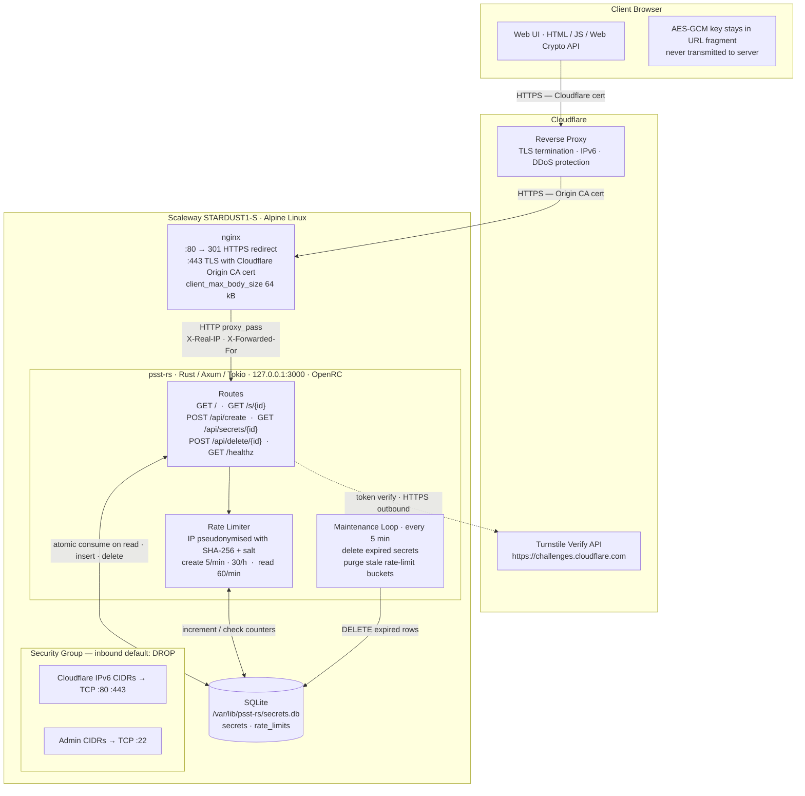

# psst-rs

`psst` is a minimal single-read secret sharing service.

The secret is encrypted in the browser with AES-GCM. The server only receives the `ciphertext` and the `nonce`. The key stays only in the URL fragment after `#`.

## Project Scope

`psst-rs` is meant to transport small secrets ephemerally, not manage them long term.

The service is meant to:

- create a small secret and return a shareable link;
- let the recipient read that secret exactly once;
- delete it automatically after reading or expiration;
- delete a secret before it is read from the browser that created it.

The service is not trying to cover:

- user accounts, login flows, roles, or rich administration;
- attachments, file uploads, or large payloads;
- permanent secrets, multi-read links, or secret history;
- search, secret listings, or an open public API;
- HTML rendering of secret content.

## Invariants To Preserve

These points are the core product contract. Contributions should preserve them:

- the secret is encrypted in the browser; the key must never be sent to the server;
- the key stays in the URL fragment and must not be retransmitted by the JavaScript;
- the maximum cleartext secret size is `16 KiB`;
- reads must stay atomic: only one request can consume a secret;
- the service must not log the cleartext secret, the key, the URL fragment, the full request body, or sensitive tokens;
- creation must stay protected by Turnstile and application-side limits.

## Reference Architecture



The Rust application is not meant to terminate TLS itself. It listens locally behind the reverse proxy. The firewall only allows Cloudflare egress IPs inbound on HTTP/HTTPS — direct access to the origin is blocked.

## Prerequisites

- Rust and Cargo
- a recent Node.js for automated frontend tests
- a recent browser with the Web Crypto API

## Run Automated Tests

Quick compile check:

```bash
cargo check
```

Full test suite:

```bash
make test
```

Or in detail:

```bash
make test-rust
make test-frontend
```

## Home Lab Deployment

The simplest flow goes through the repository `Makefile`.

1. Create `.env` at the repository root from `.env.example`.
2. Fill in:

```dotenv
CLOUDFLARE_API_TOKEN=...
PSST_TURNSTILE_SITE_KEY=...
PSST_TURNSTILE_SECRET_KEY=...
PSST_IP_HASH_SALT=...
```

3. Run:

```bash
make deploy
```

This command:

- builds an Alpine-compatible release binary with musl;
- copies it to `ansible/files/bin/psst-rs`;
- applies Terraform;
- deploys with Ansible;
- verifies at the end of the playbook that `/healthz` responds both from `psst-rs` directly and through nginx.

The `.env` file is ignored by Git. Do not commit secrets; only keep `.env.example` in the repository.

For local development, `make build-release` keeps a native build for your machine. Deployment packaging goes through `make build-release-alpine` in a Docker container.

If Terraform is already applied and you only want to redeploy the application:

```bash
make deploy-no-terraform
```

Tests currently cover:

- configuration;
- the SQLite layer;
- the secret lifecycle;
- HTTP routes;
- the HTML shells used by the browser UI;
- critical browser frontend paths: local encryption/decryption, UTF-8 byte counting, fragment handling, and link errors.

## Run The Service Locally

By default, the application tries to use `/var/lib/psst-rs/secrets.db`, which is not convenient for development. For a local test, use a path in `/tmp`.

```bash
PSST_RS_DATABASE_PATH=/tmp/psst-rs-dev.db cargo run
```

The server then listens on:

```text
http://127.0.0.1:3000
```

Quick check:

```bash
curl -i http://127.0.0.1:3000/healthz
```

The expected response is:

```text
HTTP/1.1 200 OK
...

ok
```

## Test The Main Browser Flow

1. Start the server locally:

   ```bash
   PSST_RS_DATABASE_PATH=/tmp/psst-rs-dev.db cargo run
   ```

2. Open `http://127.0.0.1:3000/`.

3. Enter a secret in the textarea.

4. Choose an expiration.

5. Click `Create psst link`.

6. Check that a link appears in this form:

   ```text
   https://example.tld/s/<id>#<key>
   ```

   Locally, the link host depends on `PSST_RS_PUBLIC_BASE_URL`. By default it is `https://example.tld`. For a more natural local test you can run:

   ```bash
   PSST_RS_DATABASE_PATH=/tmp/psst-rs-dev.db \
   PSST_RS_PUBLIC_BASE_URL=http://127.0.0.1:3000 \
   cargo run
   ```

### Turnstile Locally

If your Turnstile widget fails on `http://127.0.0.1:3000` or `http://localhost:3000`, the most likely cause is that your production Cloudflare key does not allow local domains.

Two simple options:

1. use Cloudflare test keys locally:

   ```bash
   PSST_RS_DATABASE_PATH=/tmp/psst-rs-dev.db \
   PSST_RS_PUBLIC_BASE_URL=http://127.0.0.1:3000 \
   PSST_RS_TURNSTILE_SITE_KEY=1x00000000000000000000AA \
   PSST_RS_TURNSTILE_SECRET_KEY=1x0000000000000000000000000000000AA \
   cargo run
   ```

2. or allow `localhost` and `127.0.0.1` in your Turnstile widget Hostname Management configuration.

Cloudflare test keys work on local domains and always return a successful validation for this test pair. Source: Cloudflare Turnstile testing docs (`https://developers.cloudflare.com/turnstile/troubleshooting/testing/`).

7. Open the full link in another tab or window.

8. Verify that the secret is displayed correctly.

9. Reload the read page. The secret should now be unavailable because it has been consumed.

## Test Early Deletion

1. Create a secret from the home page.
2. Click `Delete now`.
3. Then open the generated link.
4. The secret should be unavailable.

Important: the `delete_token` is only kept in memory in the current browser. If you close the page before clicking `Delete now`, you lose that option for this test session.

## Test A Few Useful Edge Cases

### Creation Disabled

Run the server with:

```bash
PSST_RS_DATABASE_PATH=/tmp/psst-rs-dev.db \
PSST_RS_ENABLE_CREATE=false \
cargo run
```

Expected effect:

- the form is disabled;
- the UI shows that creation is temporarily disabled.

### Missing Key

1. Create a secret.
2. Open `/s/<id>` without the `#<key>` part.

Expected effect:

- the page shows `Incomplete link: missing key.`

### Secret Already Read Or Deleted

1. Read a secret once, or delete it with `Delete now`.
2. Return to the same link.

Expected effect:

- the page shows that the secret was not found, expired, or already read.

## Useful Environment Variables For Development

- `PSST_RS_DATABASE_PATH`: SQLite file path
- `PSST_RS_PUBLIC_BASE_URL`: base used to build the final link
- `PSST_RS_BIND_ADDR`: listening address, default `127.0.0.1:3000`
- `PSST_RS_ENABLE_CREATE`: enable or disable creation
- `PSST_RS_MAX_SECRET_BYTES`: cleartext limit before encryption, default `16384`
- `PSST_RS_TURNSTILE_SITE_KEY`: Turnstile public key
- `PSST_RS_TURNSTILE_SECRET_KEY`: Turnstile private key
- `PSST_RS_IP_HASH_SALT`: server salt used to pseudonymize IPs
- `PSST_RS_CREATE_RATE_LIMIT_PER_MINUTE`: create limit per minute per hashed IP, default `5`
- `PSST_RS_CREATE_RATE_LIMIT_PER_HOUR`: create limit per hour per hashed IP, default `30`
- `PSST_RS_READ_RATE_LIMIT_PER_MINUTE`: soft read limit per minute per hashed IP, default `60`

## Rate limiting

The service currently applies:

- a create limit per minute and per hour based on a pseudonymized IP;
- a soft read limit per minute, also based on a pseudonymized IP;
- separate global quotas on the number of active secrets and the stored volume.

IP-based limits return `429 Too Many Requests`. Global unavailability, such as creation being disabled or a global quota being exceeded, returns `503 Service Unavailable`.

Behavior details are documented in [docs/rate-limiting.md](docs/rate-limiting.md).

## Current Status

This repository currently covers:

- the backend for creation, single-read access, and deletion;
- browser-side encryption/decryption;
- the v1 interface;
- backend and HTTP tests;
- server-side Turnstile verification;
- create and read rate limiting.
